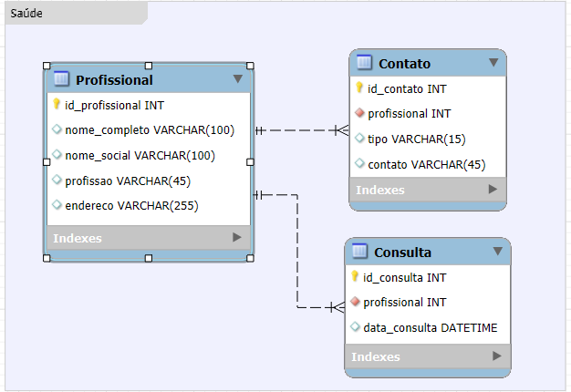

# Desafio de Desenvolvimento de API para Gerenciamento de Consultas Médicas

Esta API foi desenvolvida para gerenciar consultas médicas. O projeto é feito com Django e utiliza um banco de dados SQLite.

## Configuração:
A aplicação foi desenvolvida utilizando Python 3.10.12 e está configurada para WSL 2: Ubuntu.

clone o repositório:
```
git clone https://github.com/GustavoNav/api-lacrei
```

Acesse o diretório do projeto:

```
cd api-lacrei
```

crie o ambiente virtual:
```
python3 -m venv venv
```


Ative o Ambiente Virtual

- No Windows:
```
venv\Scripts\activate
```

- No Linux/macOS:
```
source venv/bin/activate
```

instale os requirements.txt:
```
pip install -r requirements.txt
```

Realize as migrations:
```
python3 manage.py migrate
```

### Executar API
- Para Testes Unitários
```
pytest
```

- Para Rodar a API Localmente

```
python3 manage.py runserver
```

## Arquitetura

### Banco de Dados
O banco de dados foi projetado para atender às necessidades da API e está implementado em models.py. O modelo lógico é representado na imagem abaixo:

Modelo Lógico do Banco de Dados:
<br>


- **Profissional** Tabela principal que representa o profissional.
- **Contato** Tabela para armazenar dados de contato dos profissionais, incluindo e-mail, telefone celular e telefone fixo. (Contato é um valor multivalorado dependendo da regra de negócio, como nesse caso não foi especificado, foi optado por criar uma tabela separada)
- **Consulta** Tabela que representa as consultas.

O banco de dados utiliza SQLite, o banco padrão do Django, que proporciona leveza e simplicidade.

### API
A API está implementada em views.py e utiliza uma função central para processar as solicitações. A estrutura das URLs é a seguinte:

- **Profissionais**: api/profissionais/
- **Contatos**: api/contatos/
- **Consultas**: api/consultas/

Cada URL direciona para o método apropriado da API, facilitando a manutenção e a escalabilidade.

#### Sanitização
Para garantir a segurança da API, as variáveis **CharField** foram sanitizadas para evitar a inserção de códigos mal-intencionados. Foi utilizado ferramentas do Django para validar e filtrar os inputs, prevenindo ataques de injeção e outros tipos de entradas maliciosas.